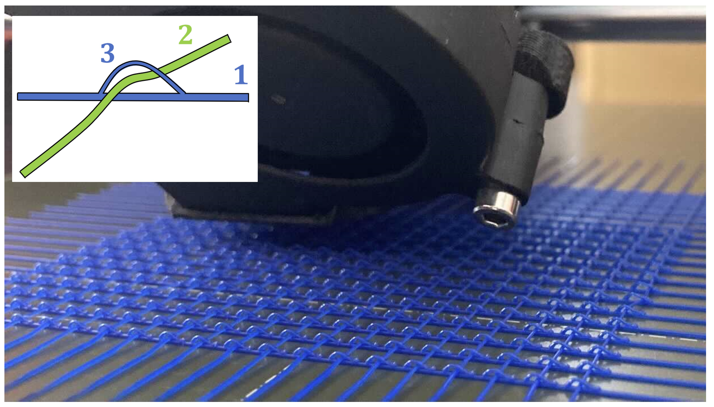

# Programmable Digital Weaves
\
[Yue Li](https://liyuesolo.github.io/), [Juan Montes Maestre](https://dl.acm.org/profile/99660986570), [Bernhard Thomaszewski](https://n.ethz.ch/~bthomasz/), [Stelian Coros](https://crl.ethz.ch/people/coros/index.html)\
IEEE Robotics and Automation Letters (RA-L), 2022
### [Paper](https://crl.ethz.ch/papers/PDWPreprintRAL2022.pdf) [Video](https://www.youtube.com/watch?v=OQfsXoXeAwg)

## Code Structure

Projects/ProgrammbleDigitalWeaves/
- [include & src] contains header and source files
- [GCode] contains sample GCodes
- [Data] meshes for rendering

## Compile and Run
Simply execute the build.sh file

## Third Party Library Required

Libigl (https://libigl.github.io/) 

These folder should be in the same folder as the base folder.

## Third Party Attached

SpectrA (https://spectralib.org/) 

## License
See the [LICENSE](LICENSE) file for license rights and limitations.

## Contact
Please reach out to me ([Yue Li](yueli.cg@gmail.com)) if you spot any bugs or having quesitons or suggestions!